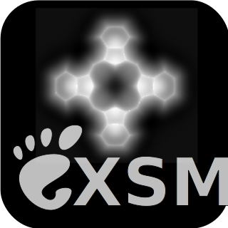

## 1. General Information

GXSM -- Gnome X Scanning Microscopy: A multi-channel image and
vector-probe data acquisition and visualization system designed for
SPM techniques (STM, AFM, etc.), but also SPA-LEED. A plug-in interface
allows any user add-on data-processing and special hardware and
instrument support.

Based on several hardware options it supports a commercially available
DSP hardware and provided also Open Source Code for all the low level
signal processing tasks and instrument controls in a most flexible and
adaptable manner.

All latest stable software is available
via SVN (gxsm2) and GIT (gxsm3) only

or Live Demo/Install CD:
http://www.ventiotec.de/linux/GXSM-Linux.iso

Legacy GXSM Web Site: http://gxsm.sf.net

We are in the process of migrating to Github.

## 2. Installation

gxsm3 requires GTK+ >= 3.14.0, GtkSourceView >= 3.14.0, libfftw, libnetcdf, libquicktime
and PyGobject 3.0.x are required to enable python / scripting support.

Simple install procedure:

  % git clone ... gxsm3-src			# checkout / unpack the sources
  % cd gxsm3-src				# change to the toplevel directory
  % ./autogen.sh				# run the `autogen' script
  % make					# build gedit
  [ Become root if necessary ]
  % make install				# install gxsm3

See the file 'INSTALL' for more detailed information.

## 3. How to report bugs

Bugs should be reported to the [Gitlab issue tracking system](https://github.com/pyzahl/Gxsm3/issues).

In the bug report please include:

* Information about your system. For instance:

   - Version of gxsm3
   - Operating system and version
   - Version of the gtk+, glib and gnome libraries

  And anything else you think is relevant.

* How to reproduce the bug. 

* If the bug was a crash, the exact text that was printed out when the
  crash occurred.

* Further information such as stack traces may be useful, but is not
  necessary. If you do send a stack trace, and the error is an X error,
  it will be more useful if the stack trace is produced running the test
  program with the --sync command line option.

## 4. Patches

Patches should also be submitted to bugzilla.gnome.org. If the patch
fixes an existing bug, add the patch as an attachment to that bug
report.

Otherwise, enter a new bug report that describes the patch, and attach
the patch to that bug report.

Please create patches with the git format-patch command.

If you are interested in helping us to develop gedit, please see the 
file 'AUTHOR' for contact information and/or send a message to the gedit
mailing list. See also the file 'HACKING' for more detailed information.

### UPDATE on bug fixes, patches and new code feature suggetsions/integrations:
Please ,make use of the GIT features to fork and submit for review!

  The gxsm team.

